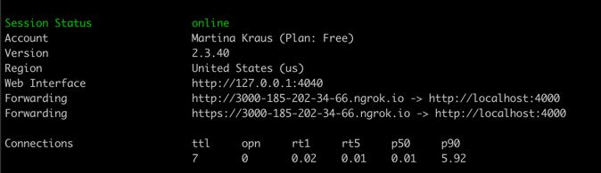
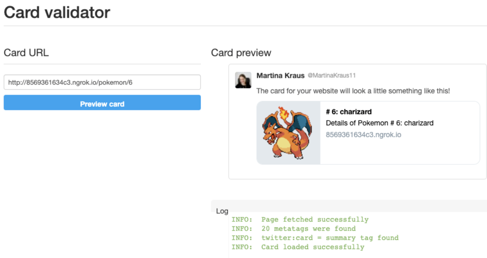

# Add Additional MetaTags for Twitter
1. Open your `SeoService` and add custom MetaTags for the TwitterBot:
```
{name: 'twitter:card', content: 'summary'},
{name: 'twitter:image', content: image},
{name: 'twitter:title', content: title},
{name: 'twitter:description', content: description},
```
2. Run `npm run build:ssr` again to compile your client and server ressources
3. Run the node Server again with `npm run serve:ssr`
4. To validate your Twitter card we need to create a tunnel to our localhost.
   1. Download the tool [Ngrok](https://ngrok.com/download)
   2. Start ngrok by running the command `./ngrok http 4000` (still asuming port 4000 is where our Server Side rendered App is still running)
   3. After running this command you'll get following output:
   
5. Use this URL for [Validating your Twitter Preview Card](https://cards-dev.twitter.com/validator) 
6. You should see something like this: (depending which sub-route you inserted)



