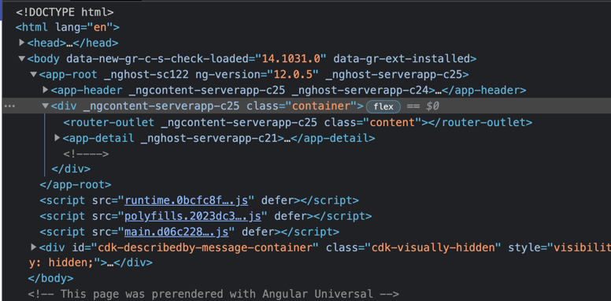

# Prerendering Routes
1. Open your `angular.json` and add scroll to `prerender` configuration
2. Add following routes for prerendering:
   1. `/pokemon/6`
   2. `/pokemon/9`
3. Run `npm run prerender`  to compile your client and server ressources and additional prerendering the routes
4. Run the node Server again with `npm run serve:ssr`
5. Navigating directly to route `locaho` you should see something like this:

(Mark the  `This page was prerendered with Angular Universal` Note at the bottom of the page)

### Hints

```
"prerender": {
    "builder": "@nguniversal/builders:prerender",
    "options": {
      "routes": [
        "/pokemon/6",
        "/pokemon/9"
      ]
    },
  ...
}
```


